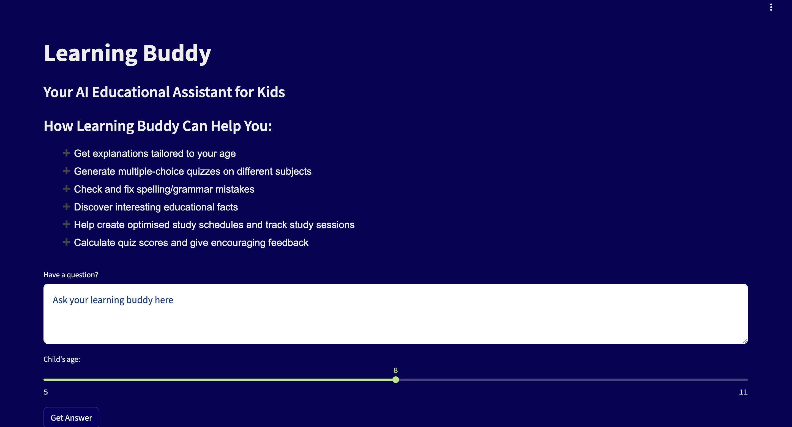

# Learning Buddy
An AI-powered educational assistant designed to help children aged 5-11 learn through age-appropriate content, interactive quizzes, feedback and personalized guidance.

🚀 Try It Live!
Access Learning Buddy on Hugging Face Spaces:[ Jade-E/learning_buddy ](https://huggingface.co/spaces/Jade-E/learning_buddy)

🌟 Features

Age-Appropriate Explanations: Content tailored to match a child's developmental level
Interactive Quizzes: Engaging multiple-choice quizzes on various subjects
Spelling & Grammar Correction: Friendly feedback on writing with corrections
Fun Facts Generator: Discover fascinating educational tidbits
Study Time Tracking: Monitor and optimize learning sessions
Quiz Scoring: Encouraging feedback with results
Learning Schedules: AI-optimized study plans

🎮 How To Use

Enter your question or learning request in the text area
Select the child's age using the slider (5-11 years)
Click "Get Answer" to receive an age-appropriate response
For quizzes, study tracking, or other tools, simply specify your request

🛠️ Tech Stack
Learning Buddy is built with:

Frontend: Streamlit - chosen for simple, high-contrast UI suitable for young learners
Agent Framework: smolagents - enabling tool use and reasoning capabilities
LLM: meta-llama/Llama-3.2-3B-Instruct - balancing capability with efficiency

Tools:

DuckDuckGo search integration for up-to-date information
7 custom-built tools handling specialized functions:

Quiz generator
Grammar correction
Fun facts retrieval
Study time tracker
Age-appropriate content adapter
Quiz scorer
Learning schedule creator

Additional utility libraries (datetime, math, etc.)

🧩 Architecture
Learning Buddy uses an agentic approach that:

Analyzes the user query
Determines the appropriate tools based on the request
Uses reasoning to select the best approach for the child's age
Generates a tailored response using the appropriate tool(s)
Formats the output to be engaging and appropriate for young learners

🤝 Contributing
Contributions are welcome! Please feel free to submit a Pull Request.

Fork the repository
Create your feature branch (git checkout -b feature/amazing-feature)
Commit your changes (git commit -m 'Add some amazing feature')
Push to the branch (git push origin feature/amazing-feature)
Open a Pull Request

📝 License
This project is licensed under the MIT License - see the LICENSE file for details.
🙏 Acknowledgments

Built during the Hugging Face Agents course
Special thanks to the smolagents framework developers
Inspired by the need for age-appropriate digital learning tools
